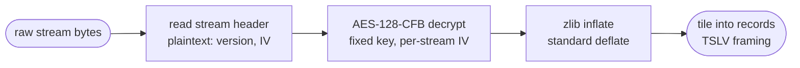

# Stream decoding

This document covers how a single encrypted, compressed report stream (such as `Contents`) becomes a flat sequence of
records. It builds on [The container](02-container.md), which produced the raw stream bytes.

The pipeline is:

## The stream header

A `Contents`-style report stream begins with a single plaintext record of type `0xFFFF` (the sibling `QESession` and
`PromptManager` streams differ — see [Sibling streams](#sibling-streams) below). It is not encrypted, because it carries
the information needed to start decryption. Its body is:

| Field         | Size     | Meaning                                       |
| ------------- | -------- | --------------------------------------------- |
| `isEncrypted` | 2 bytes  | whether the payload is encrypted              |
| `version`     | 2 bytes  | format version                                |
| `useFixedKey` | 2 bytes  | whether the fixed engine key is used          |
| `IV`          | 16 bytes | the AES initialization vector — present only when `isEncrypted` |

The IV is **per stream**: each stream in the file (and in each subreport) has its own. This is why two streams with
identical content still decrypt differently. The header record may declare additional trailing bytes past these fields;
the encrypted payload begins at the **end of the header record** (its declared length), not immediately after the IV.

## Decryption

The payload after the header is encrypted with **AES-128 in CFB-128 mode**:

- **Mode — CFB-128.** Plaintext byte `i` is `cipher[i] XOR keystream[i]`. The keystream for each 16-byte block is
  `E(feedback)`, where the feedback is the previous 16 ciphertext bytes and the first block uses `E(IV)`.
- **Block cipher `E` — AES-128 with two non-standard conventions.** It uses the standard AES S-box and T-tables, but a
  **transposed state layout** (the output mixes a different permutation of the input bytes than textbook AES) and a
  **non-standard key schedule**. Because the key schedule differs from the standard, the 44 expanded round-key words are
  treated as constants rather than re-derived.
- **Key — a fixed constant.** When `useFixedKey` is set (the common case), the key is a single constant embedded in the
  Crystal engine; it is the same for every fixed-key file. The expanded round keys are stored in the library
  (`crates/rpt/src/codec/crypto.rs`).
- **IV — per stream**, taken from the stream header above.

### Sibling streams

`Contents` and `ReportParametersStream` decode through exactly the pipeline above. The other two encrypted report
streams are close variants:

- **`QESession`** begins with a plaintext `QENG` header rather than the type-`0xFFFF` record. It uses **textbook**
  AES-128-CFB (standard Rijndael, not the transposed variant) with its own fixed engine key — a different constant from
  the `Contents` key — and takes its IV from the QENG header. After decryption it inflates and tiles just like
  `Contents`.
- **`PromptManager`** uses the same modified cipher as `Contents`, but with a **zero IV** and no stream header: the
  encrypted, compressed payload starts at byte 0. It inflates to one or more `CRMetaObjects` XML documents (the
  parameter definitions) rather than a record stream.

## Decompression

The decrypted bytes are a standard zlib deflate stream (it begins with a zlib header such as `78 5E` or `78 9C`).
Inflating it yields the **logical report bytes**: the uncompressed record stream. `rpt-rs` inflates with
[`miniz_oxide`].

## Tiling into records

The logical bytes are a single **flat** sequence of top-level records, laid end to end with no nesting needed to delimit
them. Cutting this sequence into individual records is _tiling_.

Each record is framed in **TSLV** form — Type, Subtype, Length, Value:

| Part          | Encoding                                                                                                                                          |
| ------------- | ------------------------------------------------------------------------------------------------------------------------------------------------- |
| flag word     | the first 2 bytes are a bit-packed flag word; clearing the flag bits gives the inline **type** read **big-endian** (e.g. `f8 64` → type `0x0064`) |
| extended type | if the flag word signals it, a 2-byte type follows instead of the inline one, read **little-endian**                                              |
| subtype       | if the flag word signals it, a 2-byte subtype word follows, read **little-endian**; its leading byte is `0x07` for `Contents` records            |
| length        | the value length, read **big-endian**, in 0/1/2/4 bytes per the flag word's length-size bits                                                      |
| value         | exactly `length` bytes of content; the next record begins immediately after                                                                       |

The flag word encodes the length-field size (its top two bits select 0, 1, 2, or 4 length bytes), whether the type is
inline or an extended little-endian word, and whether a subtype word follows.

### The per-record mask

The bytes of a record are obfuscated by an XOR mask:

- a record's **header is read with mask 0** (raw);
- a record's **content is read with mask `type & 0xFF`** — the low byte of its own type.

This mask is **per record**, reset for each top-level record. It is the reason the on-disk bytes look like high-entropy
noise even after decryption and inflation. Un-masking with the record's own type byte makes the content readable.

Tiling consumes every logical byte exactly: a correct decode walks the whole inflated stream and ends precisely at its
end, producing a flat list of top-level records.

The next step is to descend _into_ each record's content, where records nest and the mask becomes a running stack XOR —
see [The record tree](04-record-tree.md).

[`miniz_oxide`]: https://crates.io/crates/miniz_oxide
