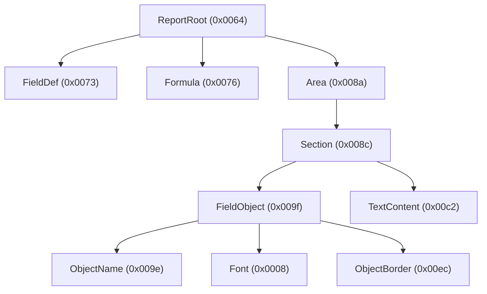

# The record tree

[Tiling](03-stream-decoding.md) produced a flat list of top-level records. This document covers the last lossless layer:
descending into each record's content, where records **nest**, to build the full record tree. This tree is the
_substrate_ the typed model is projected from.

## Records nest

Tiling treats the inflated stream as a flat sequence, but each record's content is itself a sequence of records. A
report's root record contains section and definition records; a section contains object records; an object contains its
format, font, and border records; and so on. The result is a tree:



The record header shape is regular enough to distinguish a nested record from raw leaf bytes: a nested `Contents` record
opens with a flag byte `0xF8` (the type packed inline) or `0xF9` (an extended little-endian type word follows), then a
subtype word whose leading byte is `0x07`, then a 4-byte big-endian length — so the header is 8 bytes with an inline type
and 10 with an extended one. The `0x07` subtype constraint is what rejects false headers in leaf data. A recursive reader
matches that shape (under the current mask) to decide whether the next bytes open a child record or are leaf data,
bounded by each record's declared length.

`QESession` streams nest with the same framing and stack-XOR mask, but their records use varied subtypes, so that reader
relaxes the `0x07` constraint.

## The content mask is a stack XOR

The per-record mask from tiling generalizes once records nest. The mask applied to a record's content is the **XOR of
the low bytes of all record types currently on the parse stack** — it is applied on descent and removed on ascent:

- a top-level record of type `T` reads its direct content at mask `T & 0xFF`;
- a record of type `U` nested inside `T` reads its content at `(T XOR U) & 0xFF`;
- a record of type `V` nested inside that reads at `(T XOR U XOR V) & 0xFF`; and so on.

Headers are always read at the _parent's_ content mask; the child's own type only joins the mask once the reader
descends into the child's content. Un-masking the whole tree this way makes the content directly human-readable: field
names, formula bodies, parameter references, and printer and SQL metadata all appear as plain text.

## Length-prefixed strings

Strings inside record content are length-prefixed: a **4-byte big-endian length**, then the bytes (NUL-terminated). This
is the encoding for field names, object names, formula text, SQL, and so on. The [block catalog](06-block-catalog.md)
refers to these as "lp-strings".

## The lossless substrate

The record tree is the **lossless substrate**: it represents _every_ record, whether or not the library understands its
type. Each node carries:

- its record **type** (named if recognized, otherwise just the number);
- its decoded **leaf values** (length-prefixed strings become text; the rest is kept as raw bytes);
- its **child records**.

This is exposed on the model as `Report::records` — a `Vec<Node>` where each `Node` is a typed record when recognized
and a `Node::Unknown` (raw type, decoded leaf values, child nodes) otherwise. Because the substrate keeps unmodelled
records verbatim, the read path is total: nothing is dropped, and the report can be inspected even where it is not yet
modelled.

The [typed model](05-semantic-model.md) is a projection on top of this substrate — it interprets recognized record types
into structured report objects, while the substrate continues to hold everything.

## See it yourself

The `rpt tree` command prints the decoded record tree for any report (add `--depth N` to limit nesting):

```console
$ rpt tree report.rpt
```
