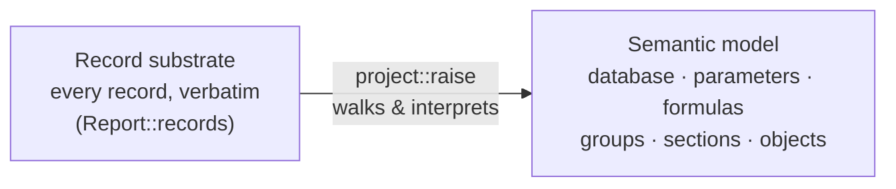

# The semantic model

The [record tree](04-record-tree.md) is a faithful but generic structure: a tree of typed records and their bytes. The
**semantic model** is the typed, structured view projected on top of it — the report as data sources, parameters,
formulas, groups, sections, and laid-out objects. This is the representation most callers work with
(`rpt::model::Report`).

## Projection, not replacement

The model is built by walking the record tree and interpreting recognized record types. It does not replace the
substrate: the record tree still holds every record (including types the model does not yet cover), and the model is a
structured projection beside it. Code that performs this walk lives in `crates/rpt/src/project/raise/`, organized by
domain (database, data definition, report definition, parameters, print options).

## The shape of a report

A `Report` groups the projected information into a handful of areas:

| Part                | What it is                                                                                              | Built from                         |
| ------------------- | ------------------------------------------------------------------------------------------------------- | ---------------------------------- |
| `summary_info`      | Title, author, timestamps, application — from the OLE property set.                                     | `SummaryInformation` stream        |
| `report_options`    | Report-level options and flags.                                                                         | report-root record, options blocks |
| `print_options`     | Page setup: paper size, orientation, margins, the page rectangle.                                       | printer/page-setup records         |
| `database`          | Connections, tables, fields, joins, and SQL commands.                                                   | `QESession` stream + field records |
| `data_definition`   | Parameters, formulas, formula variables, groups (incl. hierarchical group values), sort fields, running totals, summaries, and the record-selection formula. | data-definition records            |
| `report_definition` | The page layout: areas, sections, and the report objects inside them — field, text, line/box, picture, chart, cross-tab, and subreport objects, each with placement, fonts, borders, alignment, hyperlink, and conditional formats. | area/section/object records        |
| `subreports`        | The embedded subreports (each a nested report) and the links that pass values into them.                | `Subdocument N` streams            |
| `saved_data`        | The report's cached rows, when saved with data and decodable — stored records, not the engine's rowset. | saved-data streams                 |

A handful of further members carry authoring and environment provenance that the model keeps but the XML export does not
emit: `embeds` (embedded OLE objects, summarised by digest), `save_metadata` (per-save environment entries), `reimport`
(subreport re-import source/timestamps), and `designer_state` (on-canvas snap guidelines and object-connection edges).

The full set of public model types is re-exported from `rpt::model`, organized into submodules by domain — `document`,
`database`, `data_def`, `report_def`, `objects` (the placed report objects, incl. chart and cross-tab), `format` (fonts,
borders, hyperlinks, the typed field sub-formats), `enums`, `primitives`, and `dom` (the raw record tree). See the
[block catalog](06-block-catalog.md) for which records produce which types, and [The codebase](07-codebase.md) for where
each lives.

## Stored vs. derived

The model holds **stored** facts only — values that are actually present in the file's bytes. Values that the Crystal
engine _computes_ rather than stores (for example, how many times a field is referenced) are **not** stored on the
model. Those derived analytics are computed separately by the derive layer (the XML exporter's `export::analysis` module in
`rpt-cli`), which walks the model. This boundary is deliberate: the `rpt` model reports what is in the file; the derive
layer reports what can be inferred from it. See
[The codebase](07-codebase.md).

## Common building blocks

A few primitive types recur throughout the model:

- **`Twips`** — the unit for geometry and page measurements. One twip is 1/1440 inch (1/20 point).
- **`Color`** — a color value (stored as a `COLORREF`, i.e. `0x00BBGGRR`).
- **`Rect`** — a rectangle in twips (left, top, width/right, height/bottom).
- **`Formula`** — a formula body string.
- **`Conditioned<T>`** — a value that may be set directly or driven by a conditional-format formula. Many object and
  section format properties are conditioned: they carry both a base value and an optional formula slot.
- **`RecordRef`** — a back-reference to the record a model element was projected from.
- **`Version`** — a decoded format-version word (from the `Contents` stream header).
- **Enumerations** — typed enums (alignment, paper size, join type, parameter type, field value type, …) mirror the
  documented Crystal SDK and map the numeric codes stored in records to names.

## Where projection stops

When a record type is recognized and modelled, it becomes a typed element. When it is not, it stays in the record
substrate as an `Unknown` node and is still counted in the report's record inventory. The model therefore covers a
growing subset of the format while the substrate remains complete. The [support matrix](09-support-matrix.md) lists what
is modelled today.
