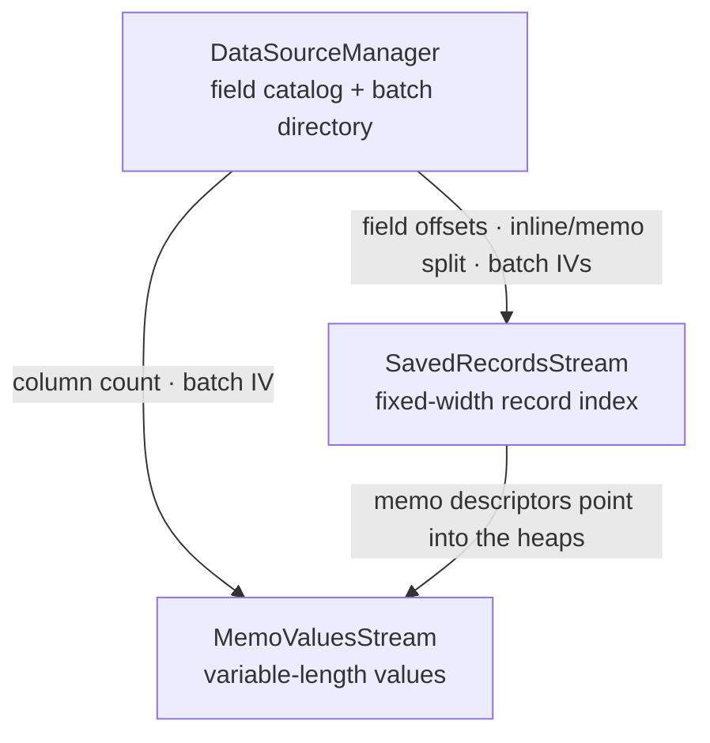

# Saved data

When a report is saved _with data_, it caches the rows it last displayed so it can be reopened without re-querying the
database. This document covers how those stored rows are laid out and decoded. It builds on
[Stream decoding](03-stream-decoding.md), whose cipher the saved-data streams reuse.

The stored rows are not the same as the rows the Crystal engine would present at print time: the engine projects a
result-field subset, reorders columns, evaluates formulas, groups/dedupes rows and formats values. rpt-rs decodes the
**stored records** — the raw cached rows as they sit in the bytes.

## Streams

| Stream               | Role                                                                                 |
| -------------------- | ------------------------------------------------------------------------------------ |
| `DataSourceManager`  | The batch directory and the stored-record field catalog (a `Contents`-style stream). |
| `SavedRecordsStream` | The fixed-width record index (one record per row), followed by the per-row memo descriptors. |
| `MemoValuesStream`   | The variable-length (string / memo) value heaps the memo descriptors point into.     |

`DataSourceManager` decodes like any other report stream (header → CFB decrypt → inflate → records, see
[Stream decoding](03-stream-decoding.md)). `SavedRecordsStream` and `MemoValuesStream` are **batches** (below).



## Batches

`SavedRecordsStream` and `MemoValuesStream` each hold a batch: `zlib(records)` encrypted with the same modified-AES-CFB
cipher as `Contents`, but with an IV built from the batch metadata rather than from a stream header:

```
IV = [ batch_size (u32 LE) | item_count (u32 LE) | item_size (u32 LE) | seq (u16 LE) ]
```

`seq` is the batch's ordinal within its stream (`0` for the first / only batch, incrementing for each subsequent batch
of a multi-batch run). A batch decodes by building this IV, CFB-decrypting, and zlib-inflating. Only block 0 depends on
the IV, so a correct IV is confirmed by a valid zlib header (`0x78`) and a successful inflate.

### Batch directory

`item_count` and `item_size` come from the `0x6d` batch-header records in `DataSourceManager` (under the saved-records
structure record `0x2d`). Each `0x6d` leaf holds two big-endian `u32`s: `item_count` at `[0..4]` and `item_size` at
`[4..8]`. `batch_size` is not stored — it is a per-batch-type default (the record index uses `1000`).

A large saved rowset splits the record index across several batches — the leading run of directory entries that share
the index `item_size`; the report's saved record count is the sum of their `item_count`s. The memo descriptors follow as
a second run of directory entries, with `item_size = memo_cols × 12`.

## The record index

`SavedRecordsStream` decodes (with IV `(1000, count, item_size)`) to a header region followed by `count` fixed-width
records. Records begin at offset `len − count * item_size`, each `item_size` bytes:

- **Inline fields** (integers) are stored in the record, read as 4-byte little-endian integers at the field's byte
  offset.
- **Variable-length fields** (string / memo) are _not_ in the record. Each row has a memo **descriptor** — a
  `memo_cols × 12` record whose 12-byte cells are `[u16 col][u16 flag][u32 heap_offset][u32 byte_length]` — that points
  directly at a value in the matching `MemoValuesStream` heap. The pointer is explicit, so a repeated value simply
  points back at an earlier heap entry; there is no delta / change mask to reconstruct.

### Field catalog

The per-field offsets and the inline-vs-memo split come from the field catalog in `DataSourceManager`, under the `0x07`
field containers:

- `0x41` — the field header, `00 <idx> 00 <offset> 00 00`, where `offset` is the field's byte offset in the record.
- `0x40` — the field descriptor, `<u32 BE nameLen> <name> <trailer>`. The trailer carries `ff ff` for a variable-length
  (memo/string) field; its absence marks a fixed inline field.

Fields are laid out in `0x41` order.

## Memo values

`MemoValuesStream` decodes to one value **heap** per memo batch, each a sequence of entries — a `u32` little-endian byte
length (including a trailing UTF-16 NUL) followed by that many UTF-16LE bytes. A cell is read by its descriptor's
`(heap_offset, byte_length)`, not by sequential position; the k-th heap aligns with the k-th descriptor batch.

Each heap's batch IV is `(memo_cols, memo_cols × 12, 12)`, where `memo_cols` is the number of memo/string columns in the
field catalog.

## Export

`rpt xml-dump` emits the stored data as a `<SavedData>` element on the main report:

```xml
<SavedData RecordCount="249">
  <Fields>
    <Field Name="countries_all_iso.id" Type="Int32sField" />
    <Field Name="countries_all_iso.name" Type="PersistentMemoField" />
    ...
  </Fields>
  <Rows>
    <Row><F>1</F><F>Afghanistan</F>...</Row>
    ...
  </Rows>
</SavedData>
```

A report with no decodable saved data emits an empty `<SavedData />`.

The library exposes the same data on the [`Report`](05-semantic-model.md) model as
`report.saved_data: Option<SavedData>` (record count, columns, row-major cell values). See [Usage](08-usage.md).

To inspect the decoded rows directly (add `--schema` for just the field catalog, `--limit N` to cap rows):

```console
$ rpt saved report.rpt
```

## Limitations

- **Stored, not presented.** The export is the stored records, so its columns, order and row count differ from the
  Crystal engine's result rowset wherever the engine projects, reorders, groups or evaluates formulas.
- **Batch class.** Two stored layouts decode. The **memo-heap** class keeps variable-length values in an external
  `MemoValuesStream`, resolved per-row via the memo descriptors (a multi-batch `MemoValuesStream` is decoded in full —
  reports are memo-cell-exact). The **packed, memo-less** class stores string columns inline in the record, compacted
  per batch to each column's per-batch maximum width, and is decoded from the record index alone. A batch whose metadata
  does not yield a valid decryption IV still emits an empty `<SavedData />`.
