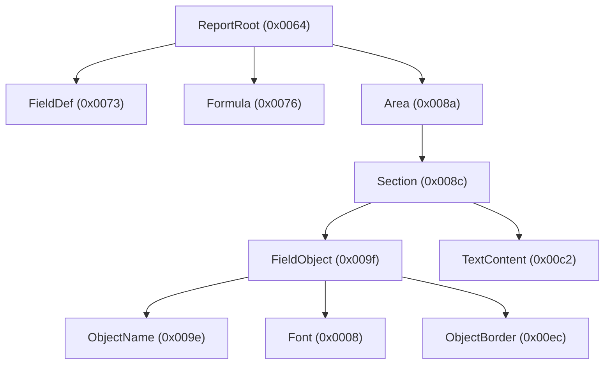

# The record tree

[Splitting the stream](03-stream-decoding.md) produced a flat list of top-level records. This document covers the last
lossless layer: descending into each record's content, where records **nest**, to build the full record tree. This tree
is what the typed model is built from.

## Records nest

Splitting treats the inflated stream as a flat sequence, but each record's content is itself a sequence of records. A
report's root record contains section and definition records; a section contains object records; an object contains its
format, font, and border records; and so on. The result is a tree:



A nested `Contents` record opens with a flag byte, then the record type's low byte, then a 2-byte big-endian **schema**
word, then the length. The flag byte's low two bits carry the record type's **high** byte, so `0xF8` frames types
`0x0000`–`0x00FF` and `0xF9` frames `0x0100`–`0x01FF` — `0xF9` is not a marker for an extended type word. (A separate
flag bit, bit 2, does move the type into its own word, for types the two inline bits cannot hold; the stream header
record `0xFFFF` is the one that uses it.) The schema word is the record type's **version**, one opaque number rather
than a dialect byte plus a version byte. Its length field is 4 bytes for a record with content, giving an 8-byte header,
and absent for an empty record, giving a 4-byte one — see
[the header is variable-width](#the-header-is-variable-width) below.

`QESession` streams nest with the same framing and stack-XOR mask. So does the saved-data `DataSourceManager` stream —
see [Saved data](05-saved-data.md) — and the `ReportParametersStream` holding the saved parameter values. Those streams
reuse type *numbers* for unrelated records (`0x0003`, `0x0007`, `0x0009` in the query engine's; `0x0030`, `0x0031`,
`0x003b` in the parameter values'), so the per-stream namespace is the stream itself; the schema word plays no part in
it.

There are four such namespaces, and a reader has to know which one it is in before a type number means anything:
**`Contents`**, **`QESession`**, the saved-data **catalog** (`DataSourceManager`), and the **report parameters**
(`ReportParametersStream`). They differ in more than their names: each states its own schema prefix (or none), whether
it defaults a missing schema word, and whether an empty record is a shape a scan may accept.

### Recognizing a nested record

In the format, a child record exists because the parent's reader asked for one *by type*, at a point in its own field
sequence. So where a record type's field layout is known, the layout says which types may nest inside it — a header is
accepted only for a declared type, and anything else stays field data however header-shaped its bytes look. *Where* a
declared child sits is still found by scanning, and it stops being so only when the tree is built by walking the tables
themselves.

A reader with no field layout for a type has to fall back on *scanning* every byte offset for something header-shaped,
which has no notion of what should be there and so fails in both directions: field data that happens to look like a
header becomes a record (taking the rest of the field with it, so the parent silently loses field bytes), while a
genuine record whose shape the filter rejects is swallowed into its parent's field bytes. Two filters make that scan
affordable, and both are the *reader's*, not the format's:

- **The schema word's high byte.** Constant across the streams one component writes whole (`0x07` in `Contents` and in
  the `ReportParametersStream`, `0x09` in `QESession`), and something field data rarely imitates. It is an observation,
  not a rule — a record whose version does not begin with it is lost, and the `DataSourceManager` catalog, written by
  several components at once, has no shared prefix to lean on.
- **The string-format bit** (flag bit 4, below), which every record a report contains sets the same way.

A declaration narrows what a scan may accept, but does not yet replace it: both filters still run under every candidate
header. They come down when the tree is built by walking the tables rather than by probing offsets, not before — so no
reader should mistake either for the format.

### The header is variable-width

The flag byte's top two bits select the length field's width — `00` no length field, `01` one byte, `10` two, `11`
four — so the framing layer sizes the header to the payload. Report files use two of the four forms: the 4-byte width
for every record that has content, and the no-length form for an empty record, which the engine writes after certain
container records as an explicit end marker (record type `T` is closed by an empty record of type `T + 1`). The bits
between (bit 5 = a schema word follows, bit 4 = the strings in this record's content are length-prefixed, bit 3 = the
content is XOR-masked) are set on every `Contents` record a report contains, which is why a `Contents` header is always
`0xF8`/`0xF9` (with content) or `0x38`/`0x39` (empty).

Bit 5 is the one that is not universal. A header carries its schema word only where that version differs from the
default the writing archive was opened at, so a record type that has never been revised is written with **no schema word
at all** — a 6-byte header — and takes its stream's default version. Such a header has no version for the prefix
heuristic to weigh, so it is read only where an enclosing record's field table asks for that very type, never at a
stream's top level. `QESession`'s `0x0008` index records are the corpus's instance of it.

The reader accepts exactly those two forms in the `Contents` and parameter-values dialects, and it has to accept the
empty one: an empty record rejected is not an error, it is four bytes of framing silently absorbed into the field bytes
of whatever contains it, shifting every field the table reads past that point. It does *not* accept the 1- and 2-byte
widths, legal at the framing layer though they are. A reader that probes every byte offset trades tolerance against
false positives, and the narrower the header the less of it is evidence that it is one — admitting those two widths
misreads field data as nested records on real reports. Even the empty form is only affordable because the schema prefix
is a second, independent check on a candidate header — so it is accepted only in the two streams that frame their end
markers that way, `Contents` and the `ReportParametersStream`. `QESession` has a prefix of its own (`0x09`) but keeps
the wide form as its only shape, and the `DataSourceManager` catalog, written by several components at once, has no
shared prefix at all, leaving the flag byte as the whole filter. A writer should emit the wide form for a record with
content and the no-length form for an empty one, which is what every engine-written file contains.

## The content mask is a stack XOR

The per-record mask from the flat split generalizes once records nest. The mask applied to a record's content is the
**XOR of the low bytes of all record types currently on the parse stack** — it is applied on descent and removed on
ascent:

- a top-level record of type `T` reads its direct content at mask `T & 0xFF`;
- a record of type `U` nested inside `T` reads its content at `(T XOR U) & 0xFF`;
- a record of type `V` nested inside that reads at `(T XOR U XOR V) & 0xFF`; and so on.

Headers are always read at the _parent's_ content mask; the child's own type only joins the mask once the reader
descends into the child's content. Un-masking the whole tree this way makes the content directly human-readable: field
names, formula bodies, parameter references, and printer and SQL metadata all appear as plain text.

## Strings come in two wire forms

A string inside record content is framed one of two ways, and the record's own header says which — **flag bit 4**:

- **Enhanced** (bit set): a **4-byte big-endian byte count**, then that many bytes. The count *includes* the trailing
  NUL, and a count of `0` is the null string with nothing following.
- **Simple** (bit clear): a NUL-terminated run with no count at all.

The choice is not something a reader has to know out of band. It is a setting on the archive doing the writing, and the
writer stamps its current value into **every** record header; a reader loads its own setting back out of the same bit at
each header, so the form in effect is always the innermost open record's. Read the wrong one and the first four
characters of the text become a length.

Everything a real engine writes uses the enhanced form, which is why the [block catalog](06-block-catalog.md) calls
these "lp-strings" and gives their layouts in that form. A writer inherits the same rule and must set the bit
deliberately: the setting **defaults off**, so a writer that leaves it alone emits NUL-terminated strings that a
length-prefixed reader mis-frames.

## A record's content is a sequence, not a layout

Inside a record, a field has no address. The content is a straight-line sequence of typed reads — the reader takes each
field in turn and stops when the record runs out — so a field's position is a consequence of everything written before
it. Three things move it:

- **A string carries its own length.** Every field after a length-prefixed string sits wherever that string ended, and
  report text is authored, so the same field lands at a different offset in two files that differ only in a caption.
- **A count decides how many bodies follow.** A run of repeated groups — a chart's font elements, a cross-tab's cells —
  is introduced by its own count, and the fields after the run begin where the run stopped.
- **The schema word can change the sequence.** A version can add a field, replace a run of fields with another, or widen
  one from two bytes to four. The header states the version; the sequence the reader walks is the one that version
  describes.

A record is also allowed to **end early**. The writer stops after the last field it has something to say about, so a
short record is not a truncated one — a reader that runs out leaves the remaining fields at their defaults rather than
failing. Two records of the same type at the same version can legitimately be different lengths.

Child records take their place in that same sequence: one exists at a point in the content because the parent's reader
asked for one **by type**, exactly as [above](#recognizing-a-nested-record) — not because something header-shaped turned
up there.

This is what the per-record **byte offsets** in the [block catalog](06-block-catalog.md) are: one reading of a sequence,
for records shaped the way the corpus's are. They hold as long as every field before them is the length it was when they
were written down. A decoder built from the offsets is right until it meets a longer name; a decoder built from the
sequence is right because the sequence is what the format is.

### Cracking an unknown layout is still byte work

Stating one record type's sequence changes nothing about how an *unstated* one is worked out. A layout nobody has
established has to be found the only way an undocumented one can be: by reading candidate values at every offset, and by
diffing a **minimal pair** — two files identical but for one authored setting — to see which bytes that setting moved.
Those instruments are untouched by any other type's layout being solved, and their continued existence is not a sign
that anything is half-finished. What changes is their role: they are how a decoder gets **written**, not how one works.

## A record is asked for, not addressed

The same holds one level up. At the **root** of a stream the records are not a tree at all: they are a sequence of
**containers** — runs closed by a designated record type, the *end marker*. A reader never scans a container for a
record; it asks for one by type, bounded by the marker:

```text
search(want, end):
    from here, over the records in order:
        this type == want  -> that is the record; carry on past it
        this type == end   -> the container is finished: the record is ABSENT
        otherwise          -> step over it and keep looking
```

Three properties of the format follow, and none of them can be expressed by addressing a record positionally:

- **An unrecognized record is stepped over**, which is the format's forward compatibility at record granularity — it is
  why a file written by a newer engine opens in an older one.
- **Absence is an ordinary outcome**, not a parse failure: an optional record that was never written is simply not found
  before the marker, and nothing in the file flags it as optional.
- **The marker bounds the search**, so "not written" is distinguishable from running off the end of the stream.

A failed search is not a rewind — the records stepped over on the way are consumed and the cursor comes to rest *on*
the marker — so a container's readers ask in stream order. End markers close root-level runs and are never nested inside
another record, which is what makes containers a property of the root sequence rather than of the record tree.
Containers do nest, but their markers are told apart by type rather than by depth: a search bounded by an outer marker
steps over an inner one like any other record.

## The lossless record layer

The record tree is **lossless**: it represents _every_ record, whether or not the library understands its type. Each
node carries:

- its record **type** (named if recognized, otherwise just the number) and its **schema** word;
- its **content**, in wire order — alternating runs of the record's own field bytes and the records nested between them,
  so a field that follows a child is distinguishable from one that precedes it.

Content is one ordered sequence rather than a leaf plus a child list, because that is what it is on disk. Two runs are
adjacent in the sequence but *not* in the file, and joining them makes a buffer that exists nowhere: a length-prefixed
string cannot span a nested record, so a "string" that appears only once the runs are concatenated is an artifact of the
join, and a fixed offset into the join can address bytes that are not adjacent on disk. A run is contiguous; a nested
part carries the framed length the child occupies.

This is exposed by the reader as `Rpt::typed_record_tree()` — a `Vec<Node>` (in `rpt_reader::raw`) where each `Node` is
a typed record when recognized and a `Node::Unknown` otherwise, whose `parts` hold that sequence (with `values()`,
`runs()` and `children()` as views over it). It is built on demand from the records the `Rpt` owns, not stored on the
format-neutral model. Because those records are kept verbatim even when unmodelled, the read path is total: nothing is
dropped, and the report can be inspected even where it is not yet modelled.

The [typed model](../reader/01-semantic-model.md) is built on top of this record layer — it interprets recognized record
types into structured report objects, while the records continue to hold everything.

## See it yourself

The `rpt tree` command prints the decoded record tree for any report (add `--depth N` to limit nesting):

```console
$ rpt tree report.rpt
```

---

← [Stream decoding](03-stream-decoding.md) · [Index](README.md) · **Next:** [Saved data](05-saved-data.md) →
