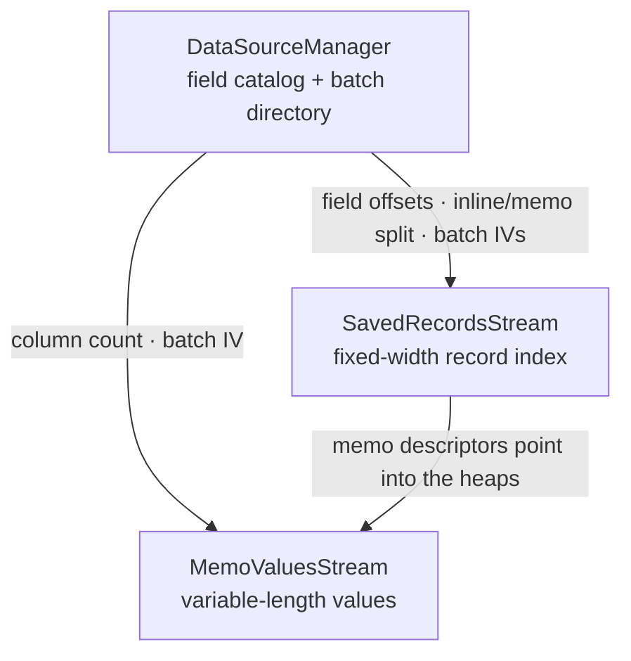

# Saved data

When a report is saved _with data_, it caches the rows it last displayed so it can be reopened without re-querying the
database. This document covers how those stored rows are laid out and decoded. It builds on
[Stream decoding](03-stream-decoding.md), whose cipher the saved-data streams reuse.

The stored rows are not the same as the rows the Crystal engine would present at print time: the engine projects a
result-field subset, reorders columns, evaluates formulas, groups/dedupes rows and formats values. rpt-rs decodes the
**stored records** — the raw cached rows as they sit in the bytes.

## Streams

| Stream               | Role                                                                                         |
|----------------------|----------------------------------------------------------------------------------------------|
| `DataSourceManager`  | The batch directory and the stored-record field catalog (a `Contents`-style stream).         |
| `SavedRecordsStream` | The fixed-width record index (one record per row), followed by the per-row memo descriptors. |
| `MemoValuesStream`   | The variable-length (string / memo) value heaps the memo descriptors point into.             |

`DataSourceManager` decodes through the ordinary stream pipeline (header → CFB decrypt → inflate → records, see
[Stream decoding](03-stream-decoding.md)), except that its records are read in the **catalog** vocabulary — a record
numbering of its own (see [The record tree](04-record-tree.md)). Written by several components at once, it is the one
stream whose schema words share no high byte, which leaves the flag byte as the whole scan filter;
`rpt dump --stream DataSourceManager` is how you look at its bytes. `SavedRecordsStream` and `MemoValuesStream` are
**batches** (below), and `rpt dump --saved` is the view of the substrate this page describes: the batch directory, each
batch's derived decrypt IV, and the stored-field catalog. `rpt saved` shows the decoded rows instead.



## Batches

`SavedRecordsStream` and `MemoValuesStream` each hold a batch: `zlib(records)` encrypted with the same modified-AES-CFB
cipher as `Contents`, but with an IV built from the batch metadata rather than from a stream header:

```
IV = [ batch_size (u32 LE) | item_count (u32 LE) | item_size (u32 LE) | seq (u16 LE) ]
```

`seq` is the batch's ordinal within its stream (`0` for the first / only batch, incrementing for each subsequent batch
of a multi-batch run). A batch decodes by building this IV, CFB-decrypting, and zlib-inflating. Only block 0 depends on
the IV, so a correct IV is confirmed by a valid zlib header (`0x78`) and a successful inflate.

### Batch directory

`item_count` and `item_size` come from the `0x6d` batch-header records in `DataSourceManager`, which the saved-records
structure record `0x2d` holds.

`0x2d` states the in-memory record width and where the stored rows live (all big-endian):

| offset | field            | notes                                                                                          |
|--------|------------------|------------------------------------------------------------------------------------------------|
| `0`    | `item_size`      | the **in-memory** (persistent) record width — `u16`, a `u32` from schema `0x0702`              |
| `2`    | —                | `u16`                                                                                          |
| `4`    | —                | `u16`, a `u32` from schema `0x0702`                                                            |
| `6`    | `record_count`   | `u32`                                                                                          |
| `10`   | —                | five `i16`, then a `u16`                                                                       |
| `22`   | streams          | 4 × `[u32 stream_id][u16 version]` — the id the container names the stream by (`<name> <id>l`) |
| `46`   | —                | `i16`                                                                                          |
| `48`   | spans            | 4 × `[u32][u32 byte_length]`                                                                   |
| `80`   | —                | two `u32`                                                                                      |
| `88`   | batch counts     | four `u16`                                                                                     |
| `96`   | batch headers    | the `0x6d` records, in four lists of the lengths just counted                                  |
| …      | trailing streams | 2 × `[u32 stream_id][u16 version][u32][u32 byte_length]`                                       |

Everything from the spans on is carried only while the record still has content, so a report whose saved data occupies
fewer streams simply ends earlier. The offsets above are the `0x0701` form; the two widened fields move everything after
them by two bytes each at `0x0702`.

Each `0x6d` batch header is:

| offset | field           | notes                                                                   |
|--------|-----------------|-------------------------------------------------------------------------|
| `0`    | `item_count`    | `u32`                                                                   |
| `4`    | `item_size`     | the batch's **on-disk** record width                                    |
| `8`    | `stream_offset` | the batch's byte offset within its physical stream                      |
| `12`   | `stream_length` | the batch's byte length within that stream                              |
| `16`   | `column_count`  | `u16`                                                                   |
| `18`   | columns         | `column_count` × `u32` — the column table                               |
| …      | —               | two `u32` and an `i16`, carried only while the record still has content |

The column table is what varies per batch: a record whose string columns are stored inline is compacted to that batch's
own per-column maxima, so the boundaries between its columns are stored rather than derived from the record layout. It
holds three values per inline string column, the third of each triple being the on-disk offset of the following field.

`batch_size` is not stored — it is a per-batch-class rule: the record index uses a fixed `1000`, while a memo-descriptor
batch's capacity is derived from a 10,224-byte budget (`10224 / item_size`).

A large saved rowset splits the record index across several batches — the leading run of directory entries that share
the index `item_size`; the report's saved record count is the sum of their `item_count`s. The memo descriptors follow as
a second run of directory entries, with `item_size = memo_cols × 12`. Which physical stream an entry belongs to is
decided by the byte chain rather than by width: each stream's entries run contiguously from its own offset 0, so the
first entry that restarts the chain opens the next stream. A third run follows, one entry per memo-value heap with
`item_size = 0`; those are the `MemoValuesStream` batches. So a directory holds three classes of entry, in that order.

## The record index

`SavedRecordsStream` decodes (with IV `(1000, count, item_size)`) to a header region followed by `count` fixed-width
records. Records begin at offset `len − count * item_size`, each `item_size` bytes:

- **Inline fields** (integers) are stored in the record, read as 4-byte little-endian integers at the field's byte
  offset.
- **Variable-length fields** (string / memo) are _not_ in the record. Each row has a memo **descriptor** — a
  `memo_cols × 12` record whose 12-byte cells are `[u16 col][u16 flag][u32 heap_offset][u32 byte_length]` — that points
  directly at a value in the matching `MemoValuesStream` heap. The pointer is explicit, so a repeated value simply
  points back at an earlier heap entry; there is no delta / change mask to reconstruct.

### Field catalog

The per-field offsets and the inline-vs-memo split come from the field catalog in `DataSourceManager`, under the `0x07`
field containers:

- `0x41` — the field header: the `0x40` descriptor below, then a `u16`, the field's byte offset in the record (a `u16`,
  a `u32` from schema `0x0702`), and an `i16`.
- `0x40` — the field descriptor: a **field reference** (the qualified field name, then a narrowing pool code and a
  `u16` index), a `u16` marker, and — while the record still has content — an `i16` and the reference's handle repeated
  as a `u16` index and a narrowing pool code. The marker reads `0xffff` for a variable-length (memo/string) field and
  `0` for a fixed inline one.

Fields are laid out in `0x41` order.

## Memo values

`MemoValuesStream` decodes to one value **heap** per memo batch, each a sequence of entries — a `u32` little-endian byte
length (including a trailing UTF-16 NUL) followed by that many UTF-16LE bytes. A cell is read by its descriptor's
`(heap_offset, byte_length)`, not by sequential position; the k-th heap aligns with the k-th descriptor batch.

Each heap's batch IV is `(memo_cols, memo_cols × 12, 12)`, where `memo_cols` is the number of memo/string columns in the
field catalog.

## Export

`rpt json-dump` emits the stored data under the main report's `saved_data` key:

```json
"saved_data": {
  "record_count": 249,
  "columns": [
    { "name": "countries_all_iso.id",   "value_type": "Int32s" },
    { "name": "countries_all_iso.name", "value_type": "PersistentMemo" }
  ],
  "rows": [
    [ "1", "Afghanistan" ]
  ]
}
```

A report with no decodable saved data emits `"saved_data": null`.

The library exposes the same data on the [`Report`](../reader/01-semantic-model.md) model as
`report.saved_data: Option<SavedData>` (record count, columns, row-major cell values). See [Usage](../reader/03-cli.md).

To inspect the decoded rows directly (add `--schema` for just the field catalog, `--limit N` to cap rows):

```console
$ rpt saved report.rpt
```

## Limitations

- **Stored, not presented.** The export is the stored records, so its columns, order and row count differ from the
  Crystal engine's result rowset wherever the engine projects, reorders, groups or evaluates formulas. The *values* are
  stored ones too: a date or time cell is the serial the engine wrote (a day number, or seconds past midnight) rather
  than a calendar value, and a `DateTime` keeps only its day half.
- **Batch class.** Two stored layouts decode. The **memo-heap** class keeps variable-length values in an external
  `MemoValuesStream`, resolved per-row via the memo descriptors (a multi-batch `MemoValuesStream` is decoded in full —
  reports are memo-cell-exact). The **memo-less** class stores string columns inline in the record, either in fixed
  slots or compacted per batch to each column's per-batch maximum width, and is decoded from the record index alone. A
  record that is packed *and* carries a memo column is handled by neither.
- **A decode failure is off the model, not invisible.** A batch whose metadata does not yield a valid decryption IV
  still emits `"saved_data": null` — the dump carries stored facts only, and why a decode gave up is not one. The reason
  is a decode diagnostic: `Rpt::saved_data_status` names it, `rpt streams` prints it, `rpt saved` reports it in place of
  the rowset, and a lost batch makes `DecodeCoverage::warning` fire. The distinctions it draws are a report saved
  without data, a catalog naming no stored field, a file describing a rowset it does not carry, a directory listing no
  record batch, a directory of nothing but memo heaps, a batch that would not decrypt/inflate, batches that decoded but
  yielded no row, and a rowset that decoded short of the count the file claims.
- **Main report only.** Saved data is read from the top-level `SavedRecordsStream` / `MemoValuesStream`; a subreport's
  own saved batch is never decoded, so a subreport's `saved_data` is always null even when it carries one.
- **Column value types are name-matched.** A stored column takes its type from the report's database field of the same
  name, falling back to a four-byte integer read when none matches. Null cells are recovered from the record's present
  bitmap on the packed path only; elsewhere an absent inline cell reads as its stored bytes.

---

← [The record tree](04-record-tree.md) · [Index](README.md) · **Next:** [Block catalog](06-block-catalog.md) →
