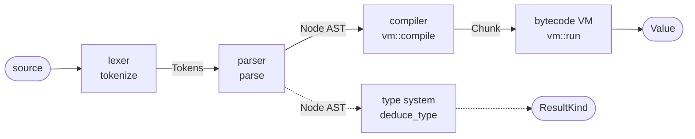

# Architecture & VM

The engine ships as the standalone **`crystal-formula`** crate (`crates/crystal-formula/`), depended on directly by its
consumers; it has no dependency on the `rpt` decoder (see the [README](README.md#why-a-standalone-crate) for the
rationale). Module names below (`lexer`, `parser`, `eval::vm`, …) are relative to that crate root.

## The pipeline

A formula string flows through five stages:



The solid path is evaluation; the dashed branch is the static type pass (`types::deduce_type`), which reads the same
AST to deduce a node's `ResultKind` but is not required to evaluate.

- **Lexer** (`lexer::tokenize`) — turns source into `Token`s. It is error-tolerant (unrecognised bytes become
  `TokenKind::Unknown`, an unterminated string runs to EOF) and never panics. Two syntaxes differ only in comment,
  string-delimiter, and statement-separator handling (see [Language reference](02-language.md)).
- **Parser** (`parser::parse`) — a recursive-descent parser over the 17-level precedence ladder. On an
  unexpected token it records a `Diagnostic` and recovers, always returning a total `Node` tree, so it is safe to run on
  any input (the foundation for evaluation, type deduction, and a future LSP).
- **Type system** (`types::deduce_type` / `types::string_max_bytes`) — a separate static pass over the AST that deduces a
  node's `ResultKind` (and, for string results, a maximum byte width), keyed by the engine's funcID tables in
  `types_table.rs`. Used by the exporter and validation; not required to evaluate.
- **Compiler + VM** (`eval::vm`) — the default runtime. `compile` lowers the AST to a flat `Chunk` of bytecode;
  `run` executes it on a stack machine. The tree-walking `Evaluator` (`eval::mod`) is kept as a reference implementation
  and differential-test oracle; both share the same value-level operations (`apply_binary`/`apply_unary`/`apply_index`),
  builtin dispatch, and reference resolution, so they produce identical results.

The free function `eval::eval(node, ctx)` compiles then runs. For a formula evaluated once per row, compile once with
`vm::compile` and reuse the `Chunk`.

## Using the crate

The crate is standalone (it depends only on `rpt-format-value`), so parsing and evaluating a formula is a few lines.
Parse with `parse`, supply the values the formula references through an `EvalContext`, and evaluate with `eval::eval`:

```rust
use crystal_formula::eval::{eval, MapContext};
use crystal_formula::{parse, RefKind, Syntax, Value};

// Crystal syntax: the return value is the last expression.
let (ast, diags) = parse("{Orders.Quantity} * {Orders.Price}", Syntax::Crystal);
assert!(diags.is_empty());

// `MapContext` is the map-backed workhorse context: bind each referenced field to a value.
let ctx = MapContext::default()
    .with_field(RefKind::Field, "Orders.Quantity", Value::Number(3.0))
    .with_field(RefKind::Field, "Orders.Price", Value::Number(25.0));

assert_eq!(eval(&ast, &ctx).unwrap(), Value::Number(75.0));
```

The same context evaluates a **Basic-syntax** formula, whose return value is whatever is assigned to the implicit
`formula` variable:

```rust
use crystal_formula::eval::{eval, MapContext};
use crystal_formula::{parse, RefKind, Syntax, Value};

let ctx = MapContext::default().with_field(RefKind::Field, "Orders.Quantity", Value::Number(3.0));
let (ast, diags) = parse("formula = {Orders.Quantity} * 2", Syntax::Basic);
assert!(diags.is_empty());
assert_eq!(eval(&ast, &ctx).unwrap(), Value::Number(6.0));
```

A formula over literals alone needs no bound fields — `MapContext::default()` (or `EmptyContext`) resolves nothing:

```rust
use crystal_formula::eval::{eval, MapContext};
use crystal_formula::{parse, Syntax, Value};

let (ast, _) = parse(r#"UpperCase("abc") & Space(1) & ToText(1 + 2)"#, Syntax::Crystal);
assert_eq!(eval(&ast, &MapContext::default()).unwrap(), Value::Str("ABC 3.00".to_string()));
```

`parse` never fails: on malformed input it recovers, returns a total AST, and reports what it had to skip as
`Diagnostic`s (see [Validation](04-validation.md) for the semantic checks layered on top).

## The value model

A runtime value is `eval::value::Value`:

| Variant | Notes |
| ------- | ----- |
| `Number(f64)` | The default numeric type. |
| `Currency(f64)` | A distinct numeric type; arithmetic promotes to `Currency` if either operand is currency. |
| `Str(String)` | Case-sensitive; string comparison is byte-lexicographic. |
| `Bool(bool)` | |
| `Date(Date)` / `Time(Time)` / `DateTime(Date, Time)` | Calendar types from `rpt_format_value::civil` — one calendar across the workspace. |
| `Array(Vec<Value>)` | 1-based subscripting (`a[1]` is the first element). |
| `Range { lo, hi, lo_incl, hi_incl }` | A `To` range; the `_To`/`To_` operators mark an excluded bound. |
| `Null` | A null database/parameter value. |

**Null propagation.** Null flows through operators and most builtins (any null argument yields `Null`), matching the
engine's default null mode. Exceptions: comparisons against null are `false`; range constructors accept null bounds; and
a few builtins (`IsNull`, `HasValue`, `ToText`) opt in to *seeing* null rather than propagating it. The engine's "convert
null values to default" report option is a caller-level concern, not baked into the evaluator.

**Numeric/currency promotion.** `*`, `/`, `\`, `Mod`, `+`, `-` yield `Currency` when either operand is `Currency`, else
`Number`. `&`/bare `ToText` coerce operands to text using `rpt_format_value` defaults (grouped 2-decimal numbers, default
date/time patterns).

## Bytecode & the stack VM

`compile` produces a `Chunk { ops, scopes }`. `ops` is a flat `Vec<Op>`; jump targets are op indices back-patched after
compilation. `scopes` records the declared scope of each non-`Local` variable (see below). The VM (`vm::run`) is a stack
machine: it maintains a value stack, a null-guard stack (for `If`), and a per-run local-variable map. Every node compiles
to code that leaves exactly one value on the stack; a statement sequence pops between statements.

The instruction set:

| Op | Effect |
| -- | ------ |
| `Push(v)` | Push a constant. |
| `LoadRef(kind, name)` | Resolve a `{ref}` via the context and push it. |
| `LoadIdent(name)` | Resolve a bare identifier: a variable, else a 0-ary builtin/constant. |
| `LoadVar(name)` / `StoreVar(name)` | Read / write a variable (assignment is an expression: `StoreVar` leaves the value on the stack). |
| `DeclareDefault(name, v)` | Bring a declared variable into scope with a default if unset (no stack effect). |
| `Call(name, argc)` | Pop `argc` args and dispatch a builtin. |
| `Bin(code)` / `Un(code)` | Apply a binary / unary operator. |
| `Index` | Apply a 1-based subscript. |
| `MakeArray(n)` | Pop `n` values into an array. |
| `Jump(t)` | Unconditional jump. |
| `CondJump(t, nullmode)` | Pop a condition: true → jump; false → fall through; null → per the null mode (used by `If`/`IIf`/`Switch`, and the back-edge of a post-test loop). |
| `CondJumpFalse(t)` | Pop a loop condition: false or null → jump (exit); true → continue (the loop entry test). |
| `PushGuard` / `GuardJump(t)` / `PopGuard` | The null-guard protocol for `If` (a later true branch wins; if no branch fires but a condition was null, the result is null). |
| `ChooseJump(targets)` | Pop a 1-based index and jump to the matching branch (`Choose`). |
| `Pop` | Discard the top of stack. |
| `Fail(msg)` | Raise a fixed `Unsupported` error (an `Unparsed`/parse-error node). |

**Control-flow lowering.** `If`/`IIf`/`Switch`/`Choose` lower to conditional jumps that preserve the engine's laziness
(only the selected branch runs). `Select … Case` is lowered at *parse* time to an `If`/`ElseIf` chain, so it needs no
dedicated bytecode. Loops lower to jumps: a pre-test `While`/`For` guards the body with `CondJumpFalse`; a post-test
`Do … Loop While/Until` puts the test on the back-edge. A `For` loop evaluates its limit and step once into hidden
locals and picks the comparison direction from the step's sign, so a negative step counts down.

**Loop safety.** A `For`/`While`/`Do` can express a non-terminating loop. The VM aborts after `STEP_LIMIT` executed
instructions and the tree-walker after `LOOP_LIMIT` iterations, each returning `EvalError::Unsupported("loop iteration
limit exceeded")` rather than hanging.

## Variables and scopes

Declarations carry a `VarScope`: `Local` (default for Basic `Dim`), `Global` (Crystal's default when no keyword), or
`Shared`. In the VM:

- **`Local`** variables live in the VM's per-run map and vanish when the formula finishes.
- **`Global`/`Shared`** variables route through the `EvalContext`'s persistent store via `var_get`/`var_set`. A
  report-lifetime context (the data pipeline's evaluation context in `rpt-data`) implements these so the variables retain
  their value across every formula and record of the run — this is how running totals and accumulator formulas work. With
  the default context (no persistent store) they fall back to per-run locals, identical to a single flattened scope. A
  re-declaration does not reset an already-set persistent variable, so an accumulated value survives across records.

## References and the evaluation context

Formulas pull outside values through `EvalContext`:

```rust
trait EvalContext {
    fn resolve(&self, kind: RefKind, name: &str) -> Option<Value>;   // {field} / {?param} / {@formula} / {#rt} / {%sql}
    fn special(&self, name: &str) -> Option<Value> { None }          // PageNumber, CurrentDate, …
    fn var_get(&self, scope: VarScope, name: &str) -> Option<Value> { None }
    fn var_set(&self, scope: VarScope, name: &str, value: Value) -> bool { false }
}
```

- **`{...}` references** are classified by their sigil into `RefKind`: `{table.field}` (Field), `{?param}` (Parameter),
  `{@name}` (Formula), `{#name}` (RunningTotal), `{%name}` (SqlExpr). `resolve` returns the bound value; `None` means
  *unknown name* (an error), while a present-but-null field returns `Some(Value::Null)`.
- **Print-state specials** (`PageNumber`, `TotalPageCount`, `CurrentDate`, `RecordNumber`, `GroupNumber`, …) route
  through `special`; without a context that supplies them they fail with a clear `Unsupported` "needs print/record
  context" error.
- **Record-navigation** (`Previous`, `Next`, `PreviousValue`, …) and the **`WhilePrintingRecords`/`WhileReadingRecords`**
  markers are recognised: the markers are no-ops here (the data pipeline interprets them as cache-refresh boundaries), and
  the navigation functions report that they need the record stream.

`MapContext` is the workhorse test/driver context (fields keyed by `(RefKind, lowercase name)`, specials by name);
`EmptyContext` resolves nothing, for literal-only formulas.

### The single-fire / per-record cache

A `{@formula}` reference resolves through `resolve`, which the data-pipeline context backs with a **per-record value
cache**: a formula evaluates at most once per record, and its dependents read the cached value. Combined with the
persistent `Global`/`Shared` store, this reproduces the engine's "evaluate once per record, accumulate across records"
model. The formula engine itself is stateless across calls except for its variable store; the caching and lifetime policy
live in the context (`rpt-data`), not in the evaluator.

## Error handling

Evaluation returns `Result<Value, EvalError>`:

| Variant | Meaning |
| ------- | ------- |
| `Unsupported(String)` | A recognised builtin or construct the evaluator does not implement (the honest "known-but-unimplemented" failure), or a construct that needs context the evaluator lacks (record navigation, print-state specials). |
| `UnknownName(String)` | An unresolved identifier or `{reference}`. |
| `TypeMismatch { what, got }` | An operator/builtin applied to the wrong value type. |
| `DivideByZero` | `/`, `\`, `Mod`, `%`, or `Remainder` by zero. |
| `BadArg(String)` | A bad argument: wrong count, out-of-range value, or an unparseable literal. |

The design principle is *fail loudly, never silently wrong*: an unimplemented function is `Unsupported`, not a guessed
value. The distinction between `Unsupported` (a known Crystal function we haven't built) and `UnknownName` (not a Crystal
function at all) comes from the funcID table in `types_table.rs`.
