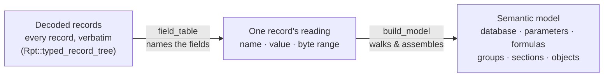

# The semantic model

The [record tree](../format/04-record-tree.md) is a faithful but generic structure: a tree of typed records and their
bytes. The **semantic model** is the typed, structured view built on top of it — the report as data sources, parameters,
formulas, groups, sections, and laid-out objects. This is the representation most callers work with
(`rpt_reader::model::Report`).

## Built beside the records, not instead of them

The model is built by walking the record tree and interpreting recognized record types. It does not replace the records:
the record tree still holds every one of them (including types the model does not yet cover), and the model is a
structured view beside it. Code that performs this walk lives in `crates/rpt-reader/src/build_model/`, organized by
domain (database, data definition, report definition, parameters, print options).

No module there addresses bytes itself. Every record is read through its own **field table** — a declaration, in
`crates/rpt-reader/src/field_table/`, of the record's content as the sequence of named, typed, schema-gated fields it
is — so a builder names the field it wants and the table says where that field sits.

## The shape of a report

A `Report` groups the decoded information into a handful of areas:

| Part                | What it is                                                                                                                                                                                                                          | Built from                         |
|---------------------|-------------------------------------------------------------------------------------------------------------------------------------------------------------------------------------------------------------------------------------|------------------------------------|
| `version`           | The `Contents` stream header's **encryption** version word; it reads `1` on every report seen.                                                                                                                                      | `Contents` stream header           |
| `authoring_version` | Which Crystal Reports wrote the file: major, minor and letter.                                                                                                                                                                      | report-root record                 |
| `has_saved_data`    | Whether the file carries a saved result set at all (the stored descriptor's presence).                                                                                                                                              | saved-data descriptor record       |
| `summary_info`      | Title, author, timestamps, application — from the OLE property set.                                                                                                                                                                 | `SummaryInformation` stream        |
| `report_options`    | Report-level options and flags.                                                                                                                                                                                                     | report-root record, options blocks |
| `print_options`     | Page setup: paper size, orientation, margins, the page rectangle.                                                                                                                                                                   | printer/page-setup records         |
| `database`          | Connections, tables, fields, joins, and SQL commands.                                                                                                                                                                               | `QESession` stream + field records |
| `data_definition`   | Parameters, formulas, formula variables, groups (incl. hierarchical group values), sort fields, running totals, summaries, and the record-selection formula.                                                                        | data-definition records            |
| `report_definition` | The page layout: areas, sections, and the report objects inside them — field, text, line/box, picture, chart, cross-tab, and subreport objects, each with placement, fonts, borders, alignment, hyperlink, and conditional formats. | area/section/object records        |
| `subreports`        | The embedded subreports (each a nested report) and the links that pass values into them.                                                                                                                                            | `Subdocument N` streams            |
| `saved_data`        | The report's cached rows, when saved with data and decodable — stored records, not the engine's rowset.                                                                                                                             | saved-data streams                 |

A handful of further members carry authoring and environment provenance: `embeds` (embedded OLE objects, summarised by
digest), `save_metadata` (per-save environment entries), `reimport` (subreport re-import source/timestamps), and
`designer_state` (on-canvas snap guidelines and object-connection edges).

Every model type is re-exported **flat** from `rpt_reader::model` (the standalone `rpt-model` crate; its internal
modules —
`document`, `database`, `data_def`, `report_def`, `objects`, `format`, `enums`, `primitives`, `saved`, `fit`,
`analysis` and the `hex_bytes` serde helper — are all private, so a caller writes `rpt_reader::model::SummaryInfo`,
never
`rpt_reader::model::document::SummaryInfo`). `Report` also carries two walk helpers, `objects()` /
`objects_mut()`, which iterate every report object in layout order across all areas. The raw record tree is **not** part
of this model — it stays in the reader (`rpt_reader::raw`, built by `Rpt::typed_record_tree()`). See the
[block catalog](../format/06-block-catalog.md) for which records produce which types,
and [The codebase](../project/codebase.md) for where each lives.

## Stored vs. derived

The model holds **stored** facts only — values that are actually present in the file's bytes. Values that the Crystal
engine _computes_ rather than stores (for example, how many times a field is referenced) are **not** stored on the
model — and they are not in the JSON export either, which is a pure projection of the stored facts. Where a consumer
needs such a value it computes it on demand (the renderer resolves display formats in `rpt-layout`; a formula's runtime
result width is computed in `rpt-formula`). This boundary is deliberate: the decoder reports what is in the file, and
inference — which can be wrong, or version-specific — stays with the consumer that needs it. See
[The codebase](../project/codebase.md).

## Common building blocks

A few primitive types recur throughout the model:

- **`Twips`** — the unit for geometry and page measurements. One twip is 1/1440 inch (1/20 point).
- **`Color`** — a color value (stored as a `COLORREF`, i.e. `0x00BBGGRR`).
- **`Rect`** — a rectangle in twips (left, top, width/right, height/bottom).
- **`Formula`** — a formula body string.
- **`Conditioned<T>`** — a value that may be set directly or driven by a conditional-format formula. Many object and
  section format properties are conditioned: they carry both a base value and an optional formula slot.
- **`RecordRef`** — a back-reference to the record a model element was decoded from.
- **`Version`** — a decoded format-version word (from the `Contents` stream header).
- **Enumerations** — typed enums (alignment, paper size, join type, parameter type, field value type, …) mirror the
  documented Crystal SDK and map the numeric codes stored in records to names.

## Detail carried on the model

Beyond the high-level shape, the model carries a layer of typed sub-detail decoded from the corresponding records:

- **Summary detail** — `SummaryField` and `RunningTotalField` carry an `operation_parameter` (the `N` of an
  Nth-largest / percentile operation) and a `secondary_summarized_field` (the second operand of a two-field operation
  such as correlation, covariance, or weighted average). Both are inert across the present corpus but are decoded from
  the summary record.
- **String field format** — `StringFieldFormat` carries the paragraph `indent` (first-line, left, and right indents in
  twips) alongside the text-format, word-wrap, and reading-order attributes.
- **Special fields** — a `SpecialFieldType` enum names the built-in field kinds (print date/time, modification
  date/time, data date/time, report title, report comments, page number, page N of M, …)
  decoded from a placed field's type code.
- **Parameters** — `ParameterField` carries the parameter type (report vs. stored-procedure), the on-panel flags
  (`show_on_panel`, `editable_on_panel`), `allow_custom_values`, the default-value display type and sort order, and the
  prompt-group linkage. `prompt_text` is `None` when the file stores none — the engine composes a prompt string when it
  prompts, which is not a fact about the file.
- **Group condition** — a `Group` carries a typed `GroupCondition` (the date/time or boolean grouping condition),
  replacing the raw grouping token.
- **Custom functions** — report-level custom functions are modelled as a distinct
  `DataDefinition.custom_functions` list (a `CustomFunction { name, syntax, text }` per function), kept apart from the
  field definitions.
- **Picture type** — `Picture.picture_type` is **derived**, not stored: it is inferred from the embedded image bytes (a
  metafile source becomes a metafile picture, otherwise a bitmap), rather than read from a stored field. A picture's
  *natural* extent is not carried at all — the engine recomputes it at load from the image's own OLE extent, and the
  object's placed box already is that extent times its scale factors — so a consumer that wants it calls
  `rpt_model::natural_extent` over the bytes the model does carry.

## Where modelling stops

When a record type is recognized and modelled, it becomes a typed element. When it is not, it stays among the decoded
records as an `Unknown` node and is still counted in the report's record inventory. The model therefore covers a growing
subset of the format while the record layer stays complete. The [support matrix](02-support-matrix.md) lists what is
modelled today.

---

[Index](README.md) · **Next:** [Support matrix](02-support-matrix.md) →
