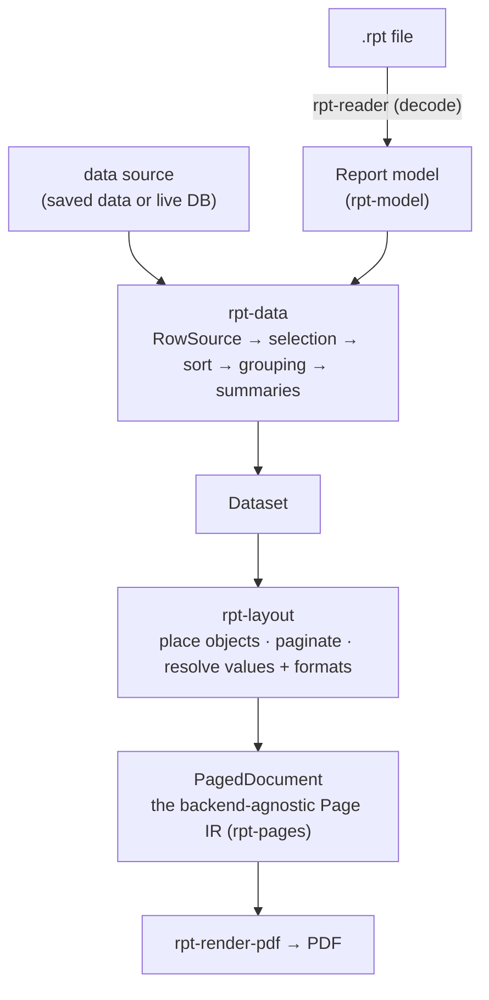

# The pipeline

The rendering layer turns a decoded [report model](../reader/01-semantic-model.md) plus a data source into paginated,
rendered output (PDF). It is built on the reader and is pure, WASM-safe Rust — the one native exception, the
live-database `RowSource`, is isolated behind a trait so the core never depends on it.

Each stage is a crate with one job (see [the codebase](../project/codebase.md) for the full table):

| Stage       | Crate                                             | Role                                                                                                                                                                                                                                                                              |
|-------------|---------------------------------------------------|-----------------------------------------------------------------------------------------------------------------------------------------------------------------------------------------------------------------------------------------------------------------------------------|
| **Model**   | `rpt-model`                                       | The format-neutral semantic model the whole pipeline consumes. Every crate below depends on **this**, never on `rpt-reader`, so the render stack links no decoder — no CFB, no inflate. Only the `rpt-render` facade links one, for `ReportDocument::load`.                       |
|             | `rpt-formula`                                     | The formula engine, depended on directly by every stage that evaluates one (`rpt-data`, `rpt-layout`, `rpt-query`).                                                                                                                                                               |
| **Data**    | `rpt-data`                                        | A `RowSource` feeds rows through record selection → sort → grouping → summaries into a `Dataset`. Carries the formula-evaluation context (`Global`/`Shared` variables, per-record cache).                                                                                         |
|             | `rpt-query` / `rpt-db-postgres` / `rpt-db-sqlite` | The live-DB path: `rpt-query` builds the joined `SELECT` over only the tables/columns the report references (unused tables are pruned rather than cross-joined) and pushes the translatable record-selection subset into `WHERE`; `rpt-db-postgres` executes it as a `RowSource`. |
| **Layout**  | `rpt-layout`                                      | Walks the report's areas/sections over the `Dataset`, resolves each object's value + display format, places it at its twip position, and paginates band-by-band. Text metrics come from an injected `TextLayout`.                                                                 |
|             | `rpt-format-value`                                | Value → string (number / currency / date / time / bool), driven by a `Locale` merged with the field's stored format.                                                                                                                                                              |
|             | `rpt-text`                                        | The real text stack (cosmic-text): font metrics + Unicode/CJK line-breaking behind the `TextLayout` trait.                                                                                                                                                                        |
|             | `metafile`                                        | The standalone Windows-metafile (EMF) parser `rpt-layout` replays vector pictures through: it resolves the metafile's coordinate machinery and emits device-independent shapes via the `MetafileSink` trait. Dependency-free and WASM-safe.                                       |
| **IR**      | `rpt-pages`                                       | The `PagedDocument` / `Page` / `DrawOp` intermediate representation every backend consumes.                                                                                                                                                                                       |
| **Backend** | `rpt-render-pdf`                                  | Serializes the Page IR to PDF — the only output backend. A new output target attaches to the Page IR through the same `PageBackend` seam rather than as a variation on this crate.                                                                                                |
|             | `rpt-render-util`                                 | Backend-serialization helpers used by the PDF backend: the twip→point constant, text-placement math (alignment anchor, justification slack, baseline fallback), image content hashing and BMP decoding — kept out of the frozen Page IR (WASM-safe, depends only on `rpt-pages`). |
| **Facade**  | `rpt-render`                                      | Ties it together (`ReportDocument`, free functions). A library crate.                                                                                                                                                                                                             |
| **CLI**     | `rpt-render-cli` (`apps/`)                        | The `rpt-render` binary: resolves the five render inputs (report, datasource, locale, parameters, output) and drives the facade.                                                                                                                                                  |

## WASM targets

The whole pipeline is WASM-safe, backend included: **`rpt-render-pdf`** (krilla + fontdb) compiles for
`wasm32-unknown-unknown` unmodified. The *host font scan* is the one thing a WASM host does not get — and it is no
longer something such a host has to work around, because the **bundled faces are the default on both halves of the font
stack**
(`RenderOptions::fonts` and `PdfOptions::fonts` both default to `FontSource::Bundled`), so nothing scans a filesystem
unless a caller asks for `FontSource::System`. A host that needs real report fonts either injects them into a
`CosmicLayout` (`load_font_bytes`) or stops at the Page IR and draws it itself. `rpt-render` has no features, so there
is no build knob to get wrong: the font-accurate stack is always compiled, and a host that wants to supply its own faces
injects a font-loaded `CosmicLayout` via `render_dataset_with`. The DB drivers are never a concern here: they are
features of the **`rpt-render-cli`** binary, not of the `rpt-render` library, so the facade links no driver in any
configuration. The `wasm` CI job compiles the WASM-safe crates for `wasm32-unknown-unknown` on every push, so an
accidental native-dep leak fails CI.

---

[Index](README.md) · **Next:** [Driving a render (library API)](02-api.md) →
